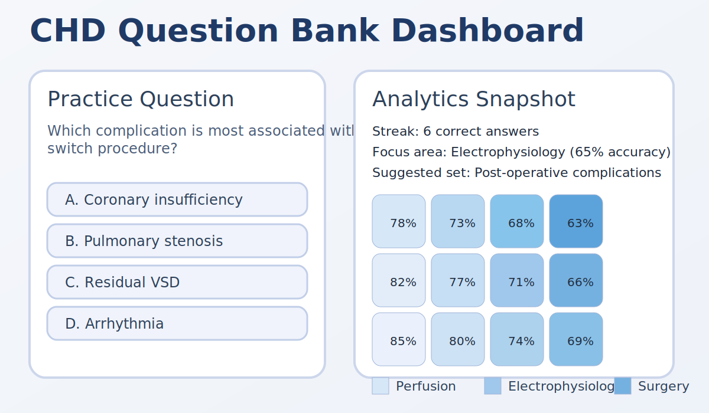

# CHD – Congenital Heart Disease Tutor Platform

This monorepo packages everything required to operate the **CHD QBank**: a congenital heart disease learning platform that combines a Step 1–style question bank, imaging and auscultation games, scheduled jobs, and accompanying automation. The primary web client is a Vite + React single-page application backed by Supabase for authentication, data storage, role-based access, and analytics. SQL migrations, operational scripts, documentation, and instructional design prompts live alongside the app so new contributors can bootstrap the full environment quickly.

## Table of contents

- [Repository layout](#repository-layout)
- [Key capabilities](#key-capabilities)
- [Prerequisites](#prerequisites)
- [Quick start](#quick-start)
- [Supabase & data model](#supabase--data-model)
- [Development workflow](#development-workflow)
- [Environment variables](#environment-variables)
- [Testing expectations](#testing-expectations)
- [Where to go next](#where-to-go-next)
- [License](#license)

## Repository layout

| Path | Description |
| --- | --- |
| `chd-qbank/` | Frontend source, Supabase assets, automation scripts, and test suites. |
| `chd-qbank/schema.sql`, `storage-policies.sql`, `cron.sql` | Canonical SQL definitions for core tables, Row Level Security, and scheduled jobs executed during bootstrap. |
| `chd-qbank/data/` | Seed templates, including question and media fixtures consumed by automation scripts. |
| `chd-qbank/supabase/` | Edge Functions and migration helpers that run inside Supabase. |
| `docs/` | Operational runbooks spanning analytics, runtime behavior, security, and retention. |
| `prompts/` | Prompt scaffolds used when authoring new clinical content. |
| `README.md`, `CONTRIBUTING.md`, `SECURITY.md` | Contributor onboarding, reporting guidance, and high-level overview documents. |

## Key capabilities

- **Invite-only access** enforced through the `signup-with-code` Edge Function and `app_settings` configuration.
- **RLS-first schema** that stores question bank content, player telemetry, and media bundles while guarding sensitive data with Supabase Row Level Security policies.
- **Practice analytics** powered by materialized views (`analytics_heatmap_agg`) and verification scripts for proactive performance checks.
- **Learning games** (CXR bounding box drills and murmur classification) that reuse the shared content library and aggregate gameplay results for leaderboards.
- **Automation suite** covering migration safety, bulk seeding, verification tasks, and synthetic data refreshes to keep environments aligned.

## Prerequisites

- **Node.js 18+**
- **npm 9+**
- Access to a **Supabase** project (separate development and production projects are recommended)
- Service-role credentials for automation tasks (kept out of version control)

Use `nvm use` or `asdf install` to adopt the version pinned in `.nvmrc`/`.tool-versions`.
This matches Vercel’s Node 18 runtime and prevents version drift.

## Quick start

1. Clone the repository and install dependencies:

   ```bash
   git clone https://github.com/<your-org>/chd.git
   cd chd/chd-qbank
   npm install
   ```

2. Copy `.env.example` to `.env.development` (or `.env`) and populate Supabase credentials (`VITE_SUPABASE_URL`, `VITE_SUPABASE_ANON_KEY`). Leave the invite placeholders in place—service-role keys and invite codes are supplied at runtime (see [Environment variables](#environment-variables)).

3. Start the development server:

   ```bash
   npm run dev
   ```

4. Visit [http://localhost:5173](http://localhost:5173) and sign in with an invited account. Initial content can be loaded by running the seeding scripts after your database is provisioned; provide invite codes via environment variables when invoking `npm run seed:invite`.

## Provision Supabase services

The application depends on a Supabase project for authentication, data storage, and scheduled jobs. Provision the backing services before inviting learners:

1. **Create or identify a Supabase project.** Separate projects for development, staging, and production prevent accidental data sharing.
2. **Link the repository to the project.** Authenticate with the Supabase CLI and connect it to the appropriate project reference:

   ```bash
   supabase login
   supabase link --project-ref <your-project-ref>
   ```

3. **Apply database schema and policies.** From the repository root run the migration helper, which applies `schema.sql`, storage policies, and cron tasks in sequence. Service-role credentials must be exported prior to running the script.

   ```bash
   export SUPABASE_URL="https://<your-project-ref>.supabase.co"
   export SUPABASE_SERVICE_ROLE_KEY="<service-role-key>"
   npm --prefix chd-qbank run migrate:qbank
   ```

4. **Seed content and invites.** Populate the question bank, media metadata, and default roles with the bundled automation.

   ```bash
   npm --prefix chd-qbank run seed:full
   INVITE_CODE="<secure-value>" INVITE_EXPIRES="2025-12-31" npm --prefix chd-qbank run seed:invite
   ```

   Rotate invite codes after each staging rehearsal and whenever a code is exposed. Use `npm --prefix chd-qbank run verify:seed` to confirm the seeded data matches expectations.

5. **Deploy Edge Functions.** The signup flow relies on the `signup-with-code` function. Deploy it through the Supabase CLI so that the client can exchange invite codes for accounts:

   ```bash
   cd chd-qbank
   supabase functions deploy signup-with-code --project-ref <your-project-ref>
   ```

6. **Review storage buckets and access policies.** `npm --prefix chd-qbank run verify:storage` checks that required buckets exist and validates their security posture. Create missing buckets through the Supabase dashboard or CLI and re-run the verification until it succeeds.

Refer to [`docs/runtime/environment-configuration.md`](./docs/runtime/environment-configuration.md) for the complete list of environment variables and secret-handling practices shared across these tasks.

## Environment profiles

The Vite workspace ships with predefined modes so you can mirror production behavior locally and in preview deployments.

| Workflow | Command | Notes |
| --- | --- | --- |
| Local development | `npm run dev` | Serves the UI with hot module reloading and development Supabase credentials. |
| Staging parity | `npm run dev:staging` | Loads `.env.staging*` files to mimic the staging database and feature flags. |
| Production simulation | `npm run dev:production` | Mirrors the production build-time flags while keeping fast refresh enabled. |
| Production build | `npm run build` | Generates an optimized bundle for Vercel or static hosting. |
| Staging build | `npm run build:staging` | Produces artifacts using staging environment variables for smoke testing. |
| Static preview | `npm run preview` | Serves the last build locally with production caching headers. |

When running scripts from the repository root, prefix commands with `npm --prefix chd-qbank` to ensure npm resolves the package-relative scripts. Automation helpers respect the `APP_ENV` variable and load `.env.<environment>`/`.env.<environment>.local` overrides so you can target staging or production credentials without juggling shell exports.

Production deploys are handled by Vercel. Promote successful preview builds after verifying Supabase CORS settings, environment variables, and cron jobs as described in [`docs/ops/release-runbook.md`](./docs/ops/release-runbook.md).

## Optional automation and scheduled jobs

Several background processes keep analytics fresh and enforce data hygiene. Enable them after the core Supabase provisioning succeeds:

- **Analytics refresh:** `cron.sql` schedules `analytics_heatmap_refresh()` via `pg_cron`. If your Supabase plan does not expose `pg_cron`, deploy a Supabase scheduled function that calls the same RPC on a cadence and track its runs in the Supabase dashboard.
- **Event retention:** Follow [`docs/ops/event-retention.md`](./docs/ops/event-retention.md) to configure the pruning procedure that purges stale telemetry. The runbook explains how to enable/disable it per environment and how to validate execution using Supabase logs.
- **Policy verification:** Automate smoke tests in CI or staging with `npm --prefix chd-qbank run verify:policies` and `npm --prefix chd-qbank run verify:analytics:heatmap`. Both scripts require service-role credentials and will fail fast if row-level security or materialized views drift from the expected configuration.

## Usage playbooks



### Learner journey

1. **Receive an invite and sign up.** Administrators share single-use codes managed via `app_settings`. Learners redeem a code through the Supabase Edge Function to activate their account and profile preferences. Invites expire automatically based on the `INVITE_EXPIRES` timestamp provided during seeding.
2. **Launch a practice session.** The dashboard presents multiple-choice questions drawn from the congenital heart disease bank and highlights supporting media (imaging, audio). Learners submit answers, review explanations, and move through a curated session or topic drill.
3. **Review analytics.** After each session the analytics heatmap aggregates performance, streaks, and suggested focus areas so learners can target weak domains and instructors can monitor cohort progress. Refreshing the analytics view triggers a Supabase RPC that rebuilds the materialized view in real time.

### Instructor tooling

- **Seed cohort data:** Use `npm --prefix chd-qbank run seed:full` against staging to populate exemplar cohorts before onboarding instructors. Combine with `npm --prefix chd-qbank run blueprint:coverage` to confirm every topic has at least one question and explanation.
- **Moderate content:** Admins authenticate with elevated roles assigned via the Supabase dashboard (see [`docs/security/admin-roles.md`](./docs/security/admin-roles.md)). The UI unlocks moderation routes for approving new questions, uploading media to Supabase Storage, and managing invite codes.
- **Export study decks:** `npm --prefix chd-qbank run export:anki` produces an Anki import that mirrors the in-app question bank for offline review sessions.

### Simulation games

- **CXR lesion localization:** Navigate to the imaging drills to practice bounding-box identification. Supabase stores anonymized attempts, enabling instructors to track progress across cohorts.
- **Murmur classification:** Launch audio drills that surface phonocardiogram loops. Learners classify each clip; Supabase captures responses and updates leaderboards after each session.

## Supabase & data model

The canonical schema lives in [`chd-qbank/schema.sql`](./chd-qbank/schema.sql) alongside supporting policies in `storage-policies.sql` and scheduled tasks in `cron.sql`. See the [analytics overview](./docs/analytics/heatmap.md) and [Supabase admin guide](./docs/security/admin-roles.md) for deeper dives into the data model and permissioning.

New environments follow the seeding workflow outlined in the [release runbook](./docs/ops/release-runbook.md).

## Development workflow

1. Branch from `main` and install dependencies.
2. Implement changes in focused commits. Update SQL migrations and automation scripts when altering data models or Supabase behavior.
3. Run the required lint/test commands for code changes.
4. Update documentation to reflect user-facing or operational differences.
5. Open a pull request describing the change, attaching screenshots for UI modifications when possible.
6. Address review feedback promptly and keep scope tight—open draft pull requests if work is still in progress.

## Environment variables

Environment configuration (local, staging, production, and automation scripts) is covered in detail inside [`docs/runtime/environment-configuration.md`](./docs/runtime/environment-configuration.md).

## Testing expectations

- Run `npm run lint` and `npm run test` before submitting feature or bug-fix pull requests.
- The `tests/e2e` directory contains Vitest-powered UI flows (murmur drills, CXR labeling, onboarding) that rely on seeded content. Keep them in sync with seed templates when updating gameplay logic.
- Document executed commands in your pull request; documentation-only updates can reference the exemption in the PR template.

## Where to go next

- Visit the [documentation index](./docs/README.md) for the complete list of operational runbooks and deep dives.
- Consult [`SECURITY.md`](./SECURITY.md) for disclosure and credential rotation processes.
- Review [`docs/ops/release-runbook.md`](./docs/ops/release-runbook.md) before shipping to staging or production.

## License

This project is licensed under the [MIT License](./LICENSE).
