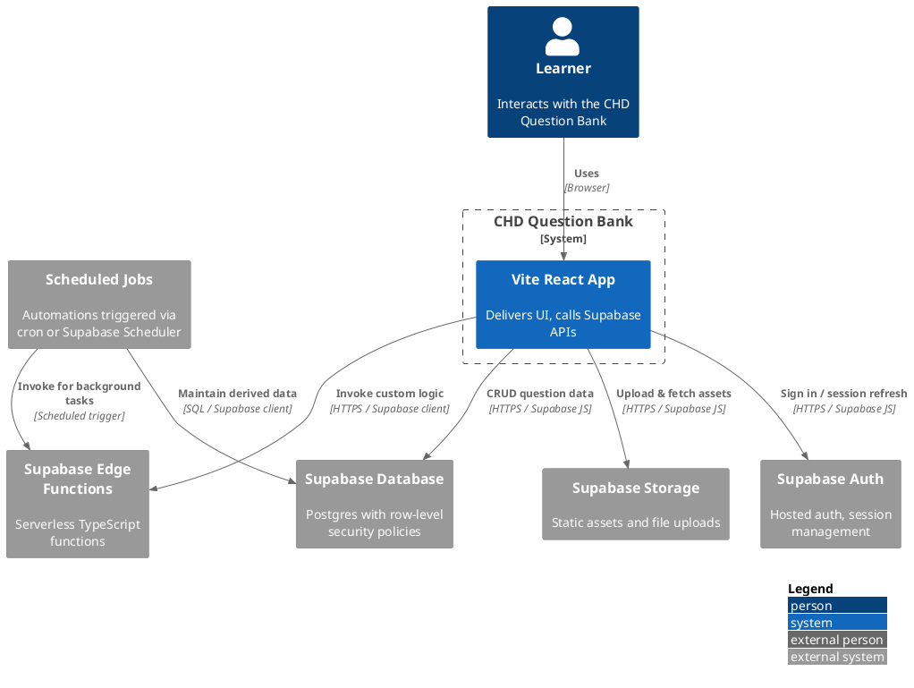

# Architecture Overview

This document provides a high-level perspective on the CHD Question Bank system. It complements the root-level README by describing how the major components communicate and where core responsibilities live.

## System Context

The application is composed of a Vite-powered React frontend that interacts with Supabase for authentication, data persistence, and file storage. Scheduled jobs and Supabase Edge Functions extend the system with asynchronous processing capabilities and custom backend logic. The diagram below summarizes the primary actors and interactions.

## Frontend (Vite React App)

- **Framework:** Vite + React, bundled for static hosting.
- **State management:** Local component state combined with hooks around Supabase client utilities.
- **Authentication:** Uses Supabase JS client to handle sign-in, sign-up, password reset, and session refresh.
- **Data access:** Communicates directly with Supabase PostgREST endpoints exposed via the Supabase client, respecting row-level security policies.
- **Asset management:** Reads and writes to Supabase Storage for media associated with questions, explanations, or supporting materials.

## Supabase Backend

### Authentication

Supabase Auth manages user identities, OAuth providers, and session tokens. Row-level security (RLS) policies in the database enforce per-user access to question bank resources. The frontend stores session tokens in memory/local storage and attaches them to subsequent requests.

### Database (Postgres)

- Stores canonical data for questions, answers, tags, exam metadata, and user progress.
- RLS policies enforce authorization in concert with Supabase Auth.
- Database functions and triggers support derived data, validation, and auditing.

### Storage

Supabase Storage buckets contain static assets such as rich media and attachments referenced by questions. The frontend retrieves signed URLs through Supabase clients, ensuring time-limited access.

## Edge Functions

Supabase Edge Functions encapsulate serverless logic written in TypeScript/JavaScript. They are invoked either directly from the frontend (for privileged operations) or from scheduled jobs. Common responsibilities include:

- Generating reports or exporting question sets.
- Performing privileged operations that should not run in the browser.
- Interfacing with external services such as email providers, analytics, or webhooks.

## Scheduled Jobs

Scheduled automation runs via Supabase Scheduler, GitHub Actions, or external cron services. These jobs typically call Edge Functions or Supabase APIs to:

- Refresh cached metrics and leaderboards.
- Send reminder notifications.
- Synchronize data with external systems (e.g., LMS integrations).

## Data Flow Summary

1. **User interaction:** The learner opens the React web app, which loads static assets and bootstraps the Supabase client.
2. **Authentication:** The user signs in via Supabase Auth. The client persists the session token and uses it for subsequent requests.
3. **Fetching data:** The frontend queries Supabase Postgres via the Supabase client to retrieve question sets, tags, and user progress.
4. **Submitting updates:** Mutations (e.g., answering questions, editing content) are sent to the database or Edge Functions, which enforce business rules and RLS.
5. **Asset retrieval:** When questions require media, the frontend requests signed URLs from Supabase Storage and streams files directly from Supabase’s CDN.
6. **Background processing:** Scheduled jobs invoke Edge Functions or direct database operations to maintain derived data, send notifications, or integrate with third-party systems.

## Extending the Architecture

When adding new capabilities:

- **Frontend:** Implement React components and hooks that call Supabase clients or invoke Edge Functions.
- **Database:** Define tables, RLS policies, and SQL functions for new domain entities. Ensure migrations align with Supabase configuration.
- **Edge Functions:** Create new serverless functions for tasks requiring secret management, heavy computation, or integrations.
- **Automation:** Register scheduled jobs to keep data fresh or perform routine maintenance.

This layered structure keeps the user experience responsive while delegating security-sensitive or resource-intensive work to Supabase-managed services.
